[<- Back to README](README.md)
# Azure Studio Auto ML Demo

## Demo Story
This demo introduces us to Susannah, a business analyst at a bike rentals company.  Susannah has a hypothesis that certain weather conditions, days of the week and holdays at least in part determine the amount of demand for bicycle rentals.  Susannah uses AutoML within Azure ML Studio to validate her hypothesis, and from there, publishes the model she has just created for her mobile app developers to leverage.  

## Demo Setup
Complete this module from Microsoft Learn: https://docs.microsoft.com/en-us/learn/modules/use-automated-machine-learning/  

## Postman Setup (for demonstrating a realtime ML endpoint)
Set up a free account at Postman.com and create a POST request to your Bike Rentals ML model (or whatever name you have given it, such as "store visits" if that is more relevant to your audience).

In "Authorization" tab of this request, set the token type as "Bearer" and the token value as the primary auth key associated with your endpoint. (This can be found on the "Consume" tab of the relevant model's endpoint).

Make the payload JSON format, and paste the following "raw" body in:

    {"data": [[1,1,2022,1,0,6,0,2,0.344167,0.363625,0.805833,0.160446]]}

## Tips

- With the Auto ML module - change the bike rentals column in the source data file to a column name that resonates most with your client. Eg # store visitors in a day instead, and name the dataset appropriately
- Ensure the "predicted_true" checkbox is unchecked in the metrics of an experiment run, for effect next time you tick it during the demo.
- Follow the practice of "tell you what you are going to tell them, then tell them, then tell them what you told them." In other words, introduce Susannah (your persona), and help your audience understand the challenge she faces, and how she will be able to use Auto ML inside Azure Machine Learning Studio to predict bicycle rentals without needing to be a data scientist. Then deliver the demo below, and finally summarise what you just showed. This will greatly help your audience digest the demo and better understand how Azure ML Studio can help them too.

 

## The Script

| Talk Track | Click Path | Screenshot  |
| :---   | :---  | :----: |
| Susannah has logged into Azure, and is now going to load her Azure ML Studio instance, where she can do everything from conduct experiments, build working machine learning models and publish them as API endpoints for her developers to add intelligence to the apps they are building.    As it's all in Azure, only authorized users such as Susannah can gain access. Furthermore, using tagging and resource groups, Susannah's company can ensure the costs incurred for AI are attributed back to each person/team on a per Azure ML Studio basis.  | Click on the "Launch Studio" button. | 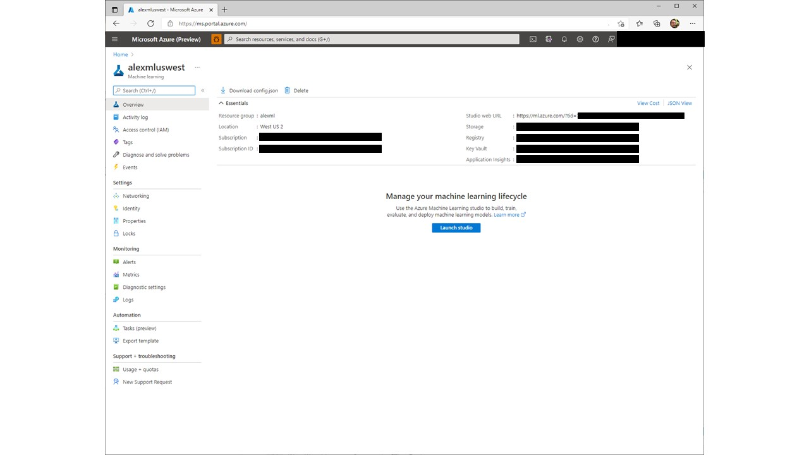 | 
| Now that Susannah's in the Machine Learning Studio, let me show you around.  (point to launch boxes) Like you saw in the slide deck, Susannah can easily launch new experiments using either Notebooks/AutoML/Designer.  (point to side menu) She can also easily reach these any time via the "Author" sub menu.  Underneath, Susannah will find the assets, which are essentially the artefacts that make up a complete machine learning process, and finally under the "manage" section she can allocate compute, train a custom model using our congnitive services and a few other things. | No clicks - instead provide a tour of the console using your mouse to help the audience follow | 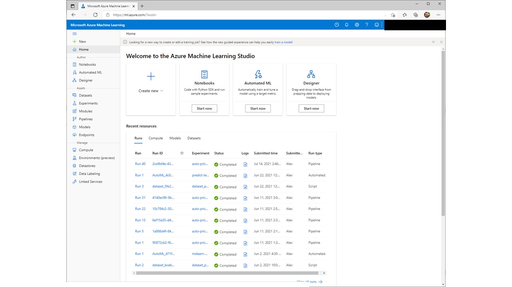 | 
| Now that Susannah is familiar with how to navigate inside the Studio, she is going to start off by creating a model using Automated ML.   Imagine Susannah as a business analyst has a hypotheses that changes in the weather, season and if a particular day falls on a public holiday impact the amount of bikes her company rents out.   Susannah has a dataset already, but isn't a data scientist - so just wants Azure to help her validate her hypotheses and build a model that helps her predict the amount of bicylce rentals. | Click Automated ML (side menu or large box)   Then click Automated ML Run | 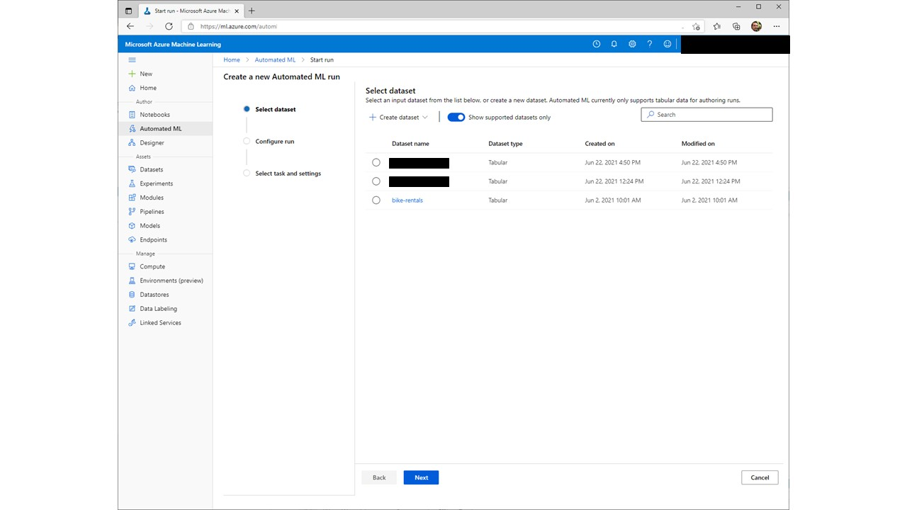 | 
| Susannah is now presented with the Azure ML Studio wizard, and the first thing she needs to do is select a dataset which she'll use Auto ML to work with.  Susannah's company has their data estate on Azure, and from inside Azure ML Studio she can easily access her company data in a secure manner that is in Azure, such as their data lake, blob storage, databases or Synapse Analytics environment. | Click the Create dataset dropdown, then select "from datastore"  Give the dataset a name: "Bicycle rentals", "Store Visits" or whatever is relevant to your audience, then click next.  Click on the dropdown for "Datastore type"  Click "cancel" (as we have a dataset already) | 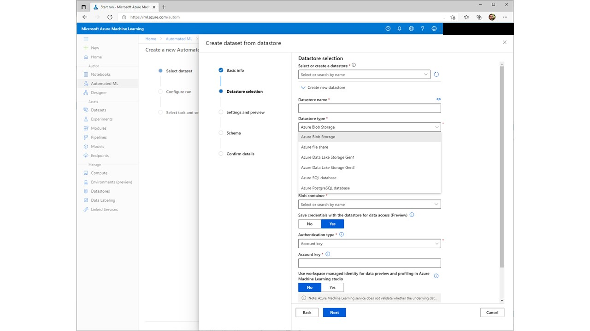 |
| To save some time I've preloaded a dataset which Susannah is going to have a look at.  Before Susannah begins her work, she has a quick look at the dataset to ensure it is the one she wants to use. She can see the "rentals" column is here, which shows the amount of bikes rented on a particular day based on the weather, season and if it was a holiday.  She wants to see if she can accurately predict the amount of rentals based on the data she has. | Click "bike-rentals" (or the name you gave your dataset)  Scroll to the last column - show the "rentals" column. | 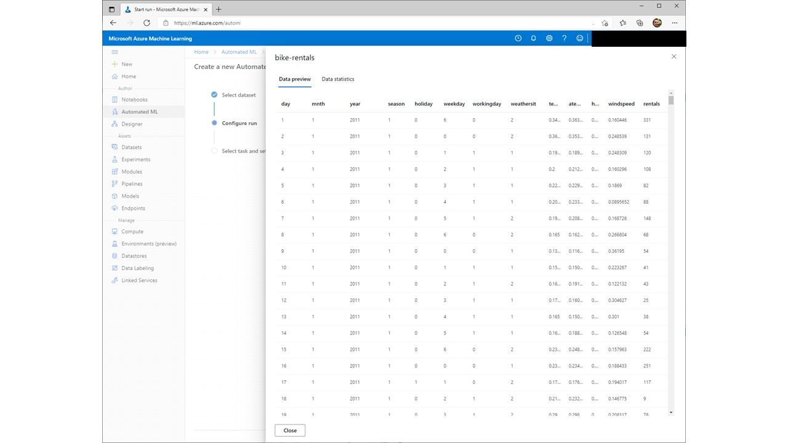 |
| Scrolling down lots of data is not always the easiest way to see what her dataset contains. So Susannah clicks the Data statistics tab to get a better understanding of the distribution of her data.  Here she can see her temperature and windspeed values have already been normalised in her dataset, and she can also see the amount of rentals and distribution of these.  Looks like this is the right dataset, so Susannah clicks "next" to progress the wizard! | Click "data statistics" tab   Click close  Click Next | 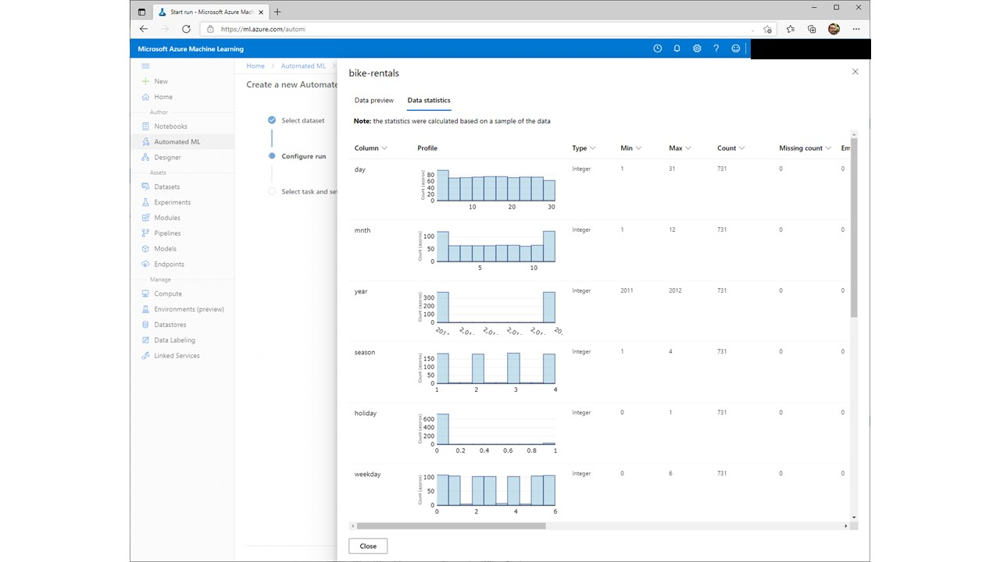 |
| Here Susannah simply needs to configure the Auto ML run. All runs are aligned to experiments, because it is possible Susannah wants to conduct several runs against and experiment and compare results.  The target column is the column Susannah wants Azure to try and predict based on the Auto ML models available - so she selects "rentals", as you will remember that was the end column in the dataset.  Finally she selects a compute cluster to run this experiment on, and clicks next. | Select an existing experiment  Select the target column "rentals"  Select a compute cluster  Click "Next" | 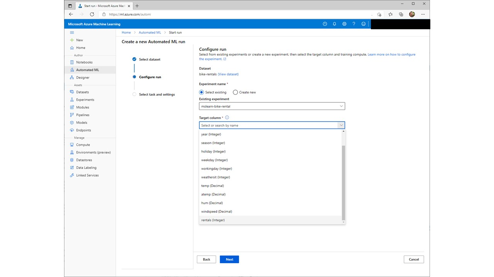 |
| Susannah now needs to select they type of Auto ML learning task she would like to perform on her dataset.  Classification is used to predict a column based on a set of categories, in this case she could predict the season based on weather.  Time series forecasting can help Susannah predict values based on the time.  In this case though, Susannah selects "regression" | Ensure Regression is ticked | 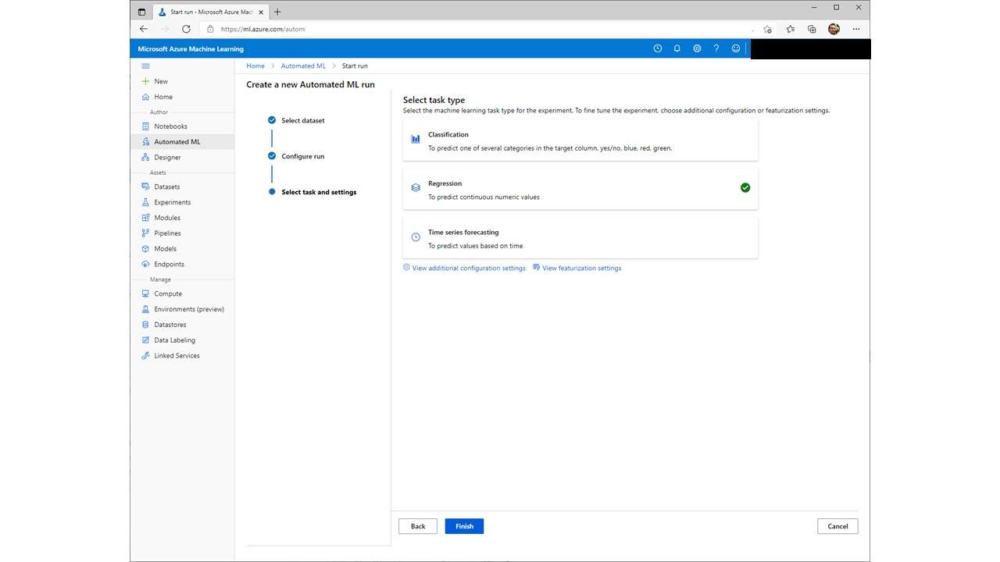 |
| If she so desires, Susannah can fine tune this experiment run by clicking either of the links below - in this case she views the "featurization settings".  Here Susannah can choose to ignore certain columns, or modify the source data using the "impute with" column to see how that changes her results in this particular run of her experiment.  In this case though she is happy with the dataset she has as-is, so clicks "cancel".  Now that the steps in the wizard are complete, Susannah simply clicks "Finish" to commence the Automated Machine Learning run. | Click "featurization settings"  Click "Cancel"  Click "Cancel" again (or Finish if you wish to run the experient) | 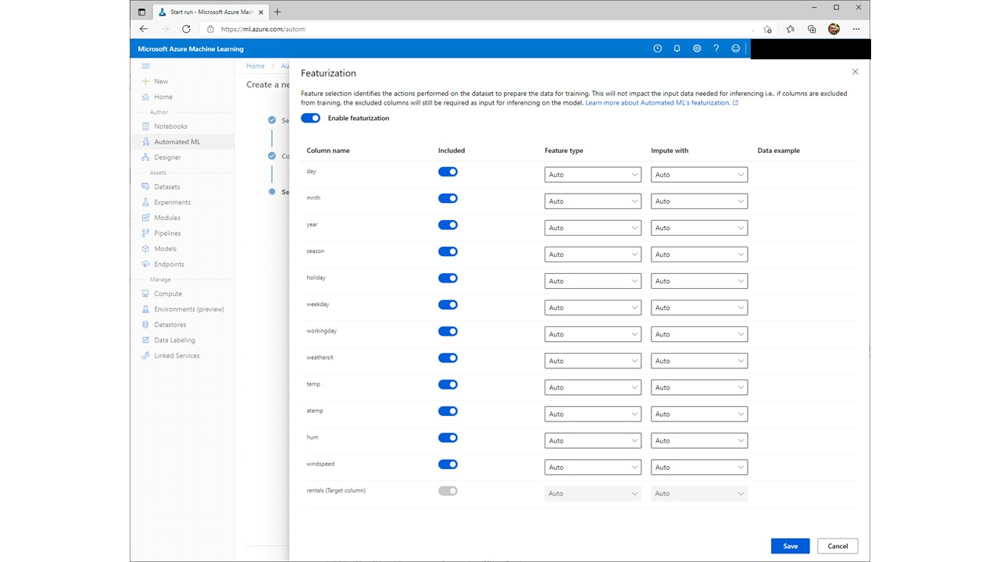 |
|Now that Susannah's experiment has run, she wants to see the results.  To do this, she simply navigates to the "Experiments" pane, and clicks into the bicycle rentals experiment, and finally, to the experiment Run that just completed. | Select the experiment you ran previously  Then click on "Run 1" | 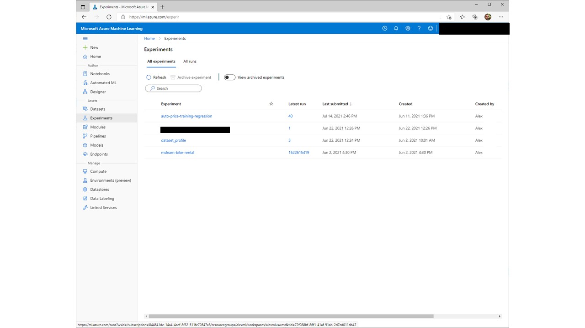  then  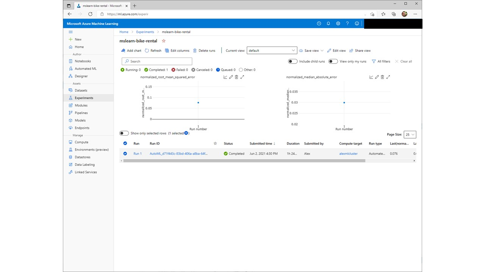 |
| Here Susannah can see all the details of the experiment she just ran, including the compute target it ran on - most importantly though, it shows the model that Azure ML determined was the closest fit to predicting bike rentals. | Point the mouse to highlight the compute target  Point the mouse to show "VotingEnsemble"  Click above on the "Models" tab | 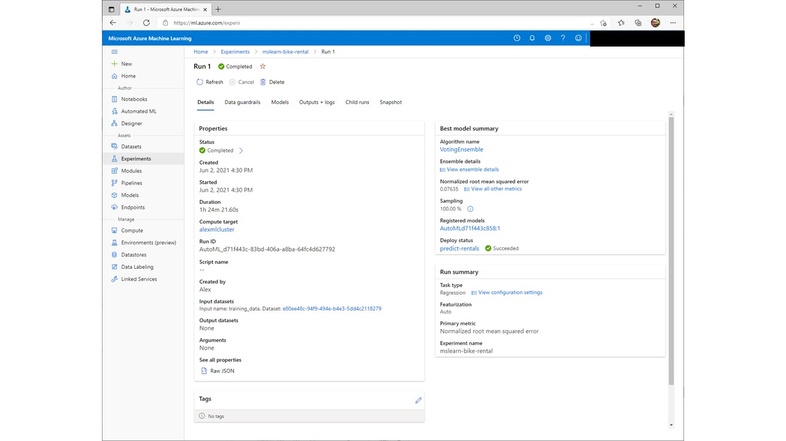 |
| Before she jumps into looking at the VotingEnsemble, she wishes to review how many models were considered by Azure ML as part of the selection process. She sees 60 different models were evaluated.  Again Susannah can see that the winner (VotingEnsemble) is at the top of the list, so clicks through to understand more about the model. | Mouse over the "Showing 1-25 of 60 models"  Click "View Explanation" alongside the "VotingEnsemble" algorithm name | 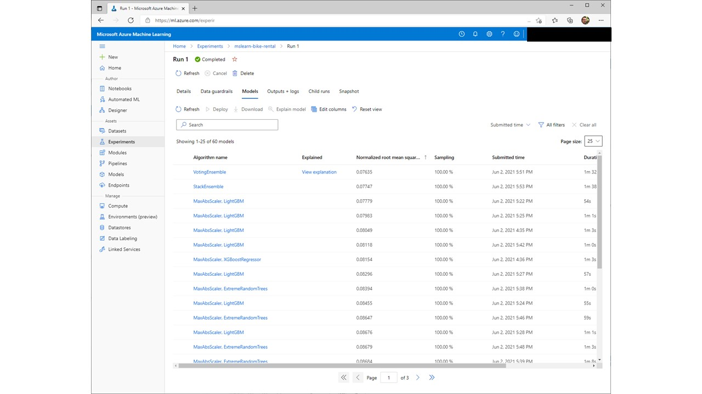 |
| First, she clicks to the "metrics" tab. Although Susannah isn't a data scientist, as a business analyst she knows that the quality of a model can be explained with a variety of measures, such as the average absolute error.  That said, she is more interested in seeing a visualisation that represents the accuracy of the model, so she selects the "Predicted vs True" checkbox. | Click the "predicted_true" checkbox, note the chart below appears. | 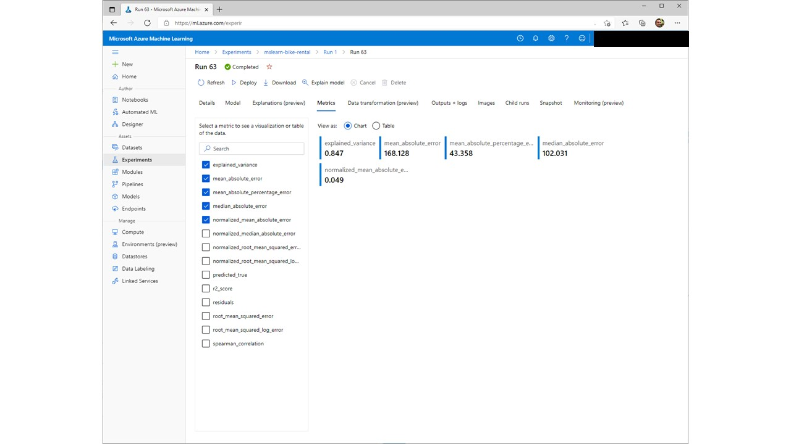   then  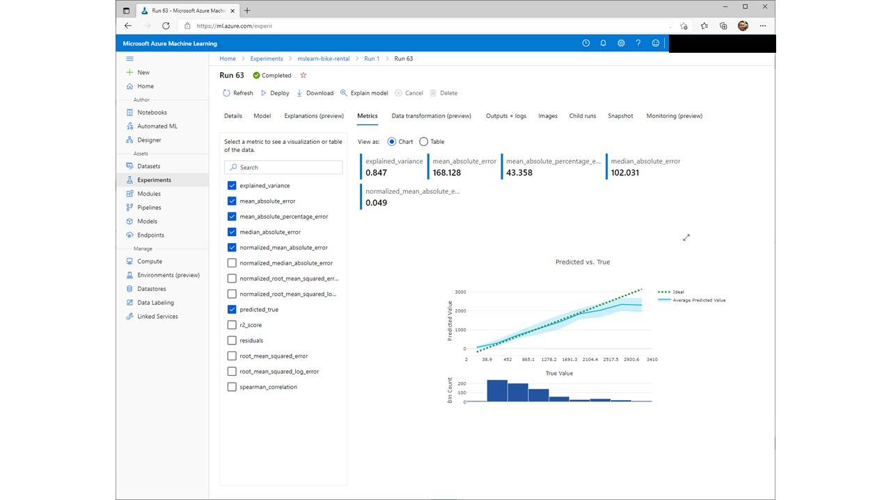 |
| Now that Susannah is confident the model is fairly accurate, she is interested in knowing what columns have the biggest impact on bike rentals - after all, some are quite easy to forecast (such as public holidays), while others such as windspeed do tend to vary a lot in a given day.  With Azure Machine Learning this is easy, as Susannah already has access to explanations to help her better understand her model.  She can see the biggest influencer on rentals is in fact the whether it is a work day, and next up is the actual temperature for the day. As the 9th column shown, she can see that windspeed doesn't seem to impact rentals significantly. | Click on "explanations"  Click on the most recent "explanation ID"  Click on the "Aggregate feature importance" tab  Move the slider from top 1-4 features from left to right | 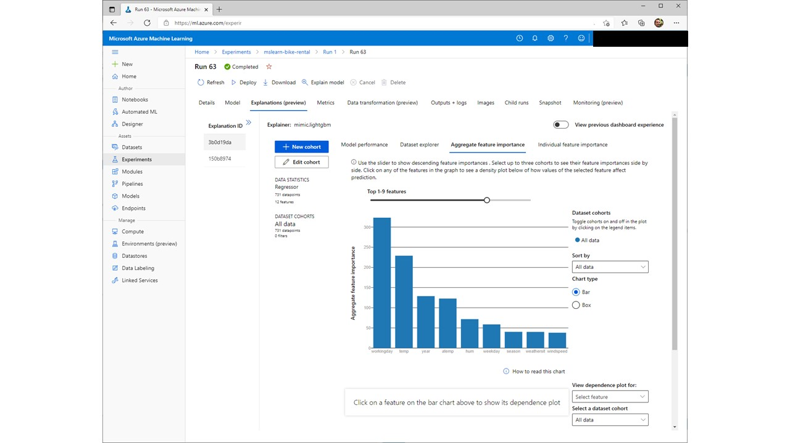 |
| Susannah is really happy with this model, and has a choice now to either deploy the model, or alternatively might choose to engage a data scientist for further tuning, depending on how her organization likes to work and the resources available to her. | Click the "Deploy" button. | 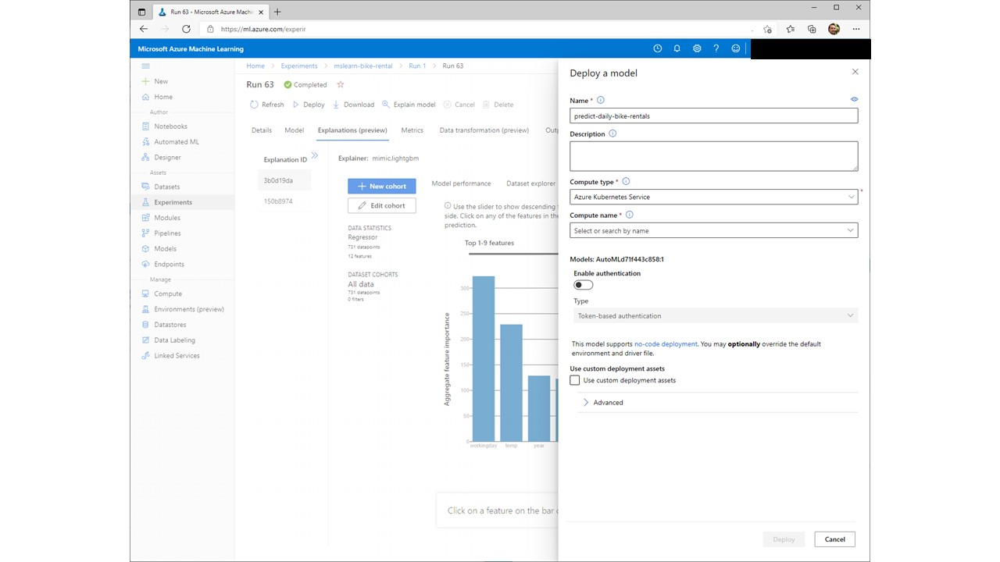 |
| Once Susannah has deployed the model, she can publish it as an endpoint for other services to access. For example, Susannah's data engineers might wish to enrich data as it is uploaded into Azure Synapse by calling the model via a Spark notebook so it's ready for analysis.  Alternatively her mobile developers might wish to add intelligence to their application by sending data to a REST API, calling the model and returning a prediction.  Let's have a brief look at how her developers might interact with the model she has just built. | Click "Endpoints"  Click "predict-rentals" (or the name of the endpoint you created | 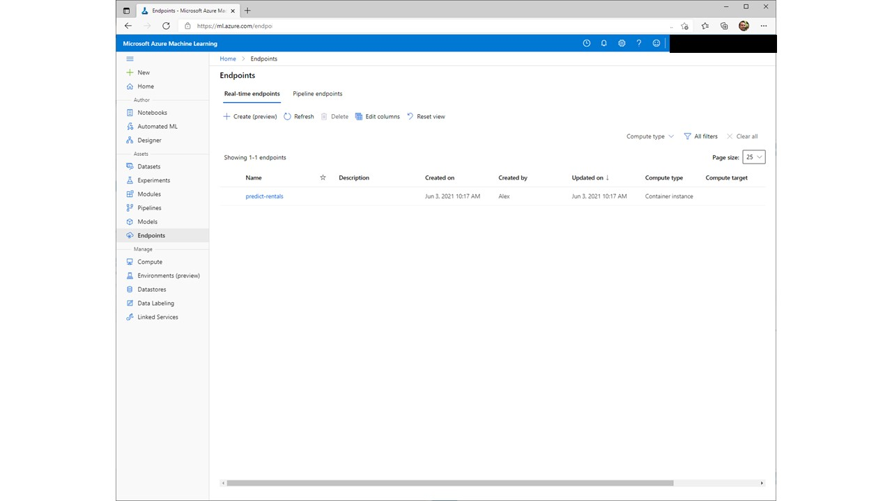 |
| Here Susannah can see her model is running, is healthy, running on an Azure container.  She can also see the REST endpoint and a Swagger URI, which is a standard developer-friendly way used to describe an API. | Mouse over the deployment state ("healthy")  Mouse over the REST endpoint URL  Click the "Consume" tab | 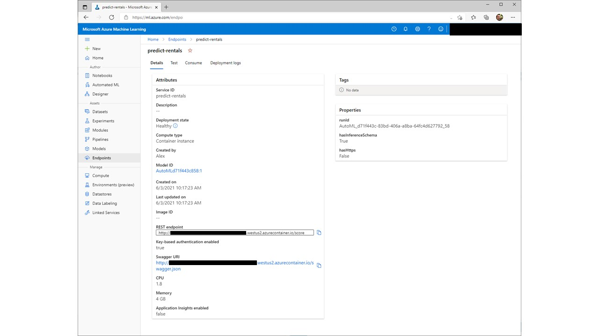 |
| Clicking on the Consume tab, Susannah can access the credentials for her REST endpoint to give to her developers. This is handy for real-time queries.  Alternatively, should her data engineers wish to enrich their datasets in Azure Synapse, they can simply click on the Python tab and grab the code they need for their notebook.  This is a great option for batch processing, and importantly, using PowerBI anyone in Susannah's organisation can not only see historic data, but also future predicted data by connecting right into their Azure data platform.  Susannah and her developers can also test the API clicking on the "Test" tab. That said, not all her developers may require access to the Azure ML Studio portal, so let’s instead see how a developer might test the endpoint is working from Postman, a popular third party app. | Click the "Python" tab  Click the "Test" tab | 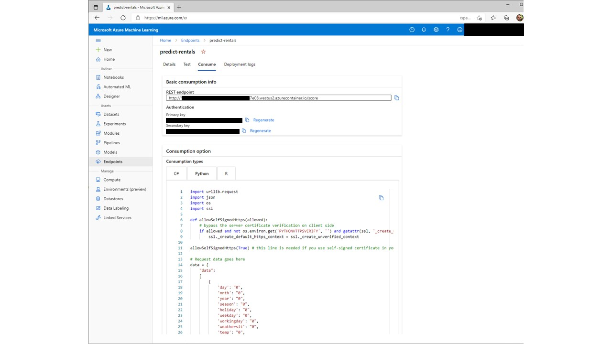 |
| Ashley is a developer, and can simply copy the URL provided by Azure ML Studio, plus some test values that represent each column in the dataset Susannah trained the model with earlier.  As he clicks send, he can see Azure Machine Learning is returning a prediction which he can then build into his app to add intelligence.  Ashley can experiment and confirm the model is working, by changing values in the payload he is sending - you can see how the predicted result changes each time the model is called. | Open a new tab with Postman in it.  Click "Send", and show the result.  Change some numbers in the data (last 3 values are best) and re-click send, to show the predicted amount of bike rentals/store visits changes. | 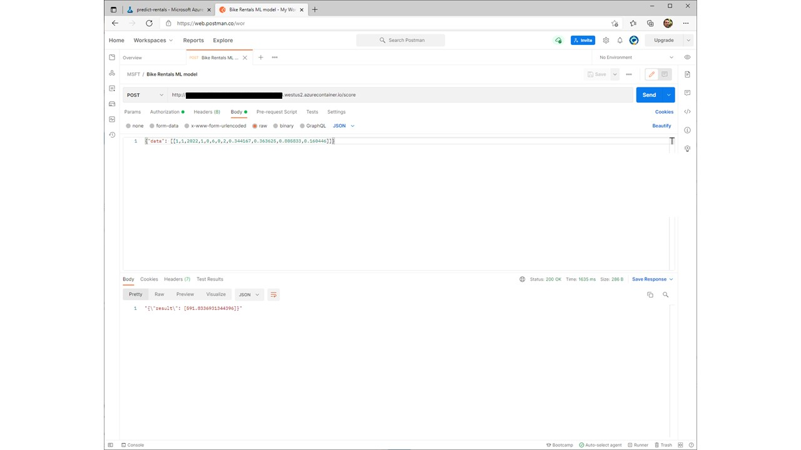
